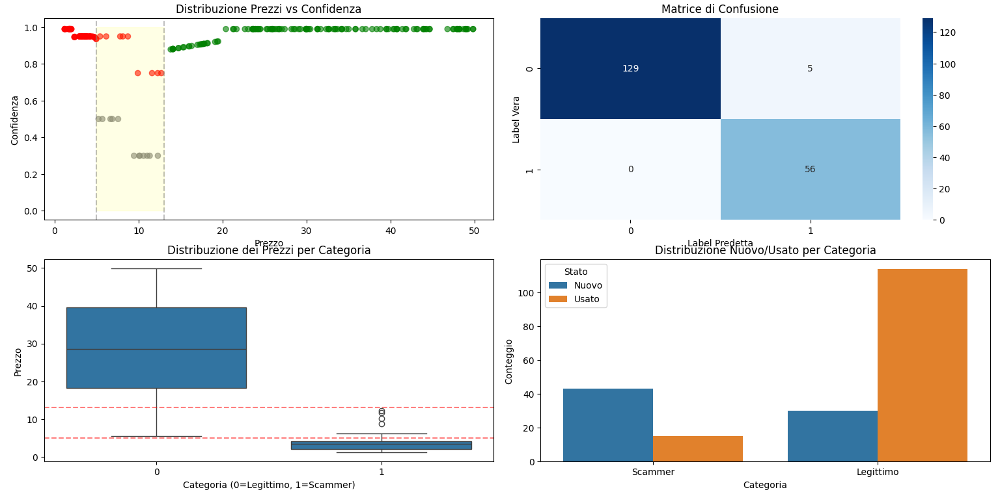

# SONNY ANGELS SCAM DETECTION

*Example of model evaluation results.*

🇬🇧 **English version (recommended)**

**Web Scraping, Reverse Engineering and Machine Learning techniques for detecting online scammers on marketplace platforms, with a case study on Sonny Angels collectibles.**

---

## Project Overview

This project explores the detection of potentially fraudulent sellers operating on online marketplaces, with a specific focus on **Sonny Angels collectibles**, a product category that has recently experienced a significant increase in fraudulent activity.  
Although the case study is domain-specific, the proposed methodology is **generalizable to other collectible markets**.

The work combines:
- reverse engineering of platform APIs,
- large-scale web scraping,
- dataset construction from real-world data,
- and a hybrid Machine Learning / rule-based model for scam detection.

---

## Motivation

The project was developed after completing coursework in **Artificial Intelligence** and **Measurement Fundamentals**, aiming to bridge theoretical concepts with a real-world application.

During the scraping phase, techniques inspired by measurement systems (e.g., dividing a large input range into smaller intervals, similarly to voltmeter resolution) were applied to partially mitigate server-side rate limiting when querying marketplace APIs.  
Although unconventional, this approach proved effective and highlights the importance of creative problem-solving in applied engineering contexts.

---

## Data Collection & Scraping

- Data were collected through automated scraping of marketplace listings.
- Different scraping strategies were adopted for **legitimate sellers** and **potential scammers**, including:
  - price-based heuristics,
  - publication frequency analysis,
  - randomized user-agent rotation,
  - adaptive query intervals.

For potential scammers, a more aggressive strategy was used to identify sellers with **unusually high volumes of low-priced items**, a common indicator of counterfeit activity.

The folder `PROCESSO_SCRAPING` contains scripts and documentation detailing the scraping pipeline.

In particular `SCRIPT_POTENZIALI_SCAMMER.py` and `SCRIPT_POTENZIALI_NON_SCAMMER.py` are the Python source codes to obtain, respectively, potential **scammers** and potential **trustable** sellers, for our final dataset.

---

## Ground Truth Construction

Ground truth labels were obtained using a conservative strategy:
- sellers explicitly declaring the sale of replicas or fakes, as shown in "esempio_di_GROUND_TRUTH", were labeled as *scammers*,
- high-confidence legitimate sellers were labeled accordingly.

This ensured reliable evaluation while minimizing label noise.

---

## Model Description

The final model is a **hybrid, rule-based classifier inspired by the 1R algorithm**, trained on the collected dataset.  
While intentionally simple, the model prioritizes:
- interpretability,
- robustness,
- conservative decision-making in borderline cases.

The trained model implementation is available in the  `final_machine_learning_model.py` file.

---

## Results & Evaluation

The model was evaluated on a labeled test set with the following results:

- **Overall Accuracy:** 98%

### Class-wise performance

- **Legitimate sellers (0):**
  - Precision: 1.00
  - Recall: 0.98
  - F1-score: ~0.99

- **Scammers (1):**
  - Precision: 0.97
  - Recall: 1.00
  - F1-score: ~0.97

These results indicate:
- extremely low false positives for legitimate users,
- zero false negatives for scammers, which is critical in fraud detection scenarios.

---

## Uncertainty Handling (Rejected Cases)

Approximately **8.5% of test samples** were intentionally rejected (prediction = -1) due to low confidence in borderline regions (typically average prices around 9–10€).

Instead of forcing a potentially incorrect classification, the model defers these cases to **manual verification**, demonstrating a cautious and safety-oriented design philosophy.

---

## Documentation

A detailed technical report describing data collection, feature engineering, heuristics, and model design is available in the PDF file:  
**SONNYANGEL_SCAM_DETECTION.pdf** (Note: the PDF was not originally intended for public or academic dissemination and is written in italian. 
It was initially prepared as a personal technical report to document and revisit this experimental approach, allowing me to recall and reuse some techiniques for potential future projects. In fact, I still rather using automated HTTP requests over the Python library BeatifulSoup for Web Scraping.
The document therefore adopts a more informal and exploratory tone, while still describing the full technical process).

---------------------------------------------------------------------------------------------------------------------------------------------------------------------------------------------------------------------
🇮🇹 Versione italiana (contesto e motivazioni personali)

**Tecniche di Web Scraping, Reverse Engineering e Machine Learning per la rilevazione di truffatori online**
Applicato inizialmente al mercato dei Sonny Angels, ma generalizzabile al mondo dei collectibles, particolarmente rilevante nell’ultimo periodo.

Da circa 10 anni mi occupo e mi interesso di **transazioni online**. Questo progetto nasce poco dopo aver concluso gli esami di Fondamenti di Misure e Intelligenza Artificiale: quest’ultimo superato con il massimo dei voti, ma con un’impostazione prevalentemente teorica e introduttiva. Infatti l’esperienza pratica di programmazione maturata fino a quel momento era infatti limitata a linee di codice su agenti logici e First Order Logic.

Nel periodo di forte diffusione dei Sonny Angels, venni quasi casualmente a conoscenza della possibile dubbia provenienza di molti prodotti venduti in negozi fisici in tutta Italia (dalle cartolibrerie ai negozi di moda per il pubblico femminile). L’osservazione mi fu segnalata da una commerciante francese di oggetti collezionabili, piuttosto conosciuta nell’ambiente. Da lì ho deciso di approfondire il fenomeno combinando web scraping, reverse engineering delle API e tecniche di machine learning.

Durante l’analisi delle API di Vinted e la fase di brainstorming sullo scraping, riguardo ad un particolare ostacolo, è emersa un’analogia con un concetto visto in Fondamenti di Misure: il funzionamento del **voltmetro**. L’idea è stata quella di prendere un intervallo più ampio (range prezzi) e suddividerlo in sotto-intervalli più piccoli, effettuando richieste automatiche su ciascuno di essi. Questo approccio ha permesso di aggirare parzialmente il rate limit imposto dal server di Vinted, adottando una **strategia non convenzionale ma efficace dal punto di vista sperimentale**.

Nel PDF “SONNY_ANGELS_SCAM_DETECTION” è descritto l’intero processo, end to end:

  - web scraping per la raccolta dei dati

  - costruzione del dataset

  - progettazione e implementazione del modello di machine learning

Il modello utilizzato non è tra i più comuni: si tratta di un approccio ibrido, ispirato a un modello rule-based simile a un 1R, nato come compromesso tra semplicità, interpretabilità e i limiti imposti dai dati disponibili. Nel PDF sono discusse anche le difficoltà incontrate e le valutazioni fatte durante lo sviluppo.

Nel file con estensione .py è presente il modello addestrato sui dati raccolti.
All’interno della cartella “PROCESSO_SCRAPING” è invece documentato nel dettaglio il processo di scraping, incluso lo script utilizzato per raccogliere gli utenti potenzialmente NON_SCAMMER.

Per lo script relativo allo scraping dei potenziali SCAMMER il ragionamento alla base è simile, ma include ulteriori accorgimenti:

  - utilizzo di range di prezzo differenti in base all’euristica adottata

  - rotazione casuale di più user-agent per mitigare le limitazioni del server

Per i potenziali scammer è stato effettuato uno scraping più aggressivo, con l’obiettivo di ottenere candidati con alta probabilità di vendita di prodotti contraffatti. Il filtro principale seleziona utenti con un numero elevato di inserzioni di Sonny Angels a prezzi anormalmente bassi. Un esempio è mostrato nel file “greatest_scammer”, che evidenzia un utente con 72 inserzioni e un prezzo medio di 3 €.

Come **ground truth** per il test del modello (vedi “esempio_di_GROUND_TRUTH”), sono stati considerati scammer “certi” quegli utenti che dichiaravano esplicitamente la natura non originale dei prodotti; successivamente è stato verificato se il modello fosse in grado di individuarli correttamente dopo l’addestramento. Un approccio simile è stato sperimentato anche su Facebook Marketplace.

Il progetto include inoltre alcune euristiche che non seguono in modo rigoroso un impianto probabilistico formale, ma che sono il risultato di **un’esperienza pragmatica sul campo**. L’obiettivo principale è stato quello di sperimentare concretamente concetti studiati in maniera teorica, approfondendoli attraverso un approccio pratico ed esplorativo.

Il lavoro si configura come un percorso di apprendimento e sperimentazione, guidato dalla volontà di affrontare il problema con uno spirito creativo e di osservarlo da prospettive diverse. Più che limitarsi a un’applicazione formale di modelli esistenti, l’intento è stato quello di **esplorare approcci non convenzionali**, lasciando spazio all’intuizione e alla reinterpretazione dei concetti studiati, andando oltre un’impostazione esclusivamente analitica.
