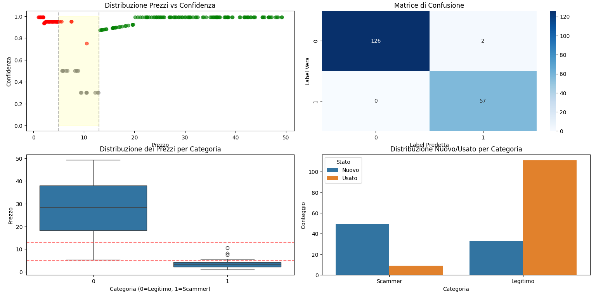

# SONNY ANGELS SCAM DETECTION

*Example of model evaluation results.*

🇬🇧 **English version (recommended)**

**Web Scraping, Reverse Engineering and Machine Learning techniques for detecting online scammers on marketplace platforms, with a case study on Sonny Angels collectibles.**

---

## Project Overview

This project explores the detection of potentially fraudulent sellers operating on online marketplaces, with a specific focus on **Sonny Angels collectibles**, a product category that has recently experienced a significant increase in fraudulent activity.  
Although the case study is domain-specific, the proposed methodology is **generalizable to other collectible markets**.

The work combines:
- reverse engineering of platform APIs,
- large-scale web scraping,
- dataset construction from real-world data,
- and a hybrid Machine Learning / rule-based model for scam detection.

---

## Motivation

The project was developed after completing coursework in **Artificial Intelligence** and **Measurement Fundamentals**, aiming to bridge theoretical concepts with a real-world application.

During the scraping phase, techniques inspired by measurement systems (e.g., dividing a large input range into smaller intervals, similarly to voltmeter resolution) were applied to partially mitigate server-side rate limiting when querying marketplace APIs.  
Although unconventional, this approach proved effective and highlights the importance of creative problem-solving in applied engineering contexts.

---

## Data Collection & Scraping

- Data were collected through automated scraping of marketplace listings.
- Different scraping strategies were adopted for **legitimate sellers** and **potential scammers**, including:
  - price-based heuristics,
  - publication frequency analysis,
  - randomized user-agent rotation,
  - adaptive query intervals.

For potential scammers, a more aggressive strategy was used to identify sellers with **unusually high volumes of low-priced items**, a common indicator of counterfeit activity.

The folder `PROCESSO_SCRAPING` contains scripts and documentation detailing the scraping pipeline.

---

## Ground Truth Construction

Ground truth labels were obtained using a conservative strategy:
- sellers explicitly declaring the sale of replicas or fakes, as shown in "esempio_di_GROUND_TRUTH", were labeled as *scammers*,
- high-confidence legitimate sellers were labeled accordingly.

This ensured reliable evaluation while minimizing label noise.

---

## Model Description

The final model is a **hybrid, rule-based classifier inspired by the 1R algorithm**, trained on the collected dataset.  
While intentionally simple, the model prioritizes:
- interpretability,
- robustness,
- conservative decision-making in borderline cases.

The trained model implementation is available in the main `.py` file.

---

## Results & Evaluation

The model was evaluated on a labeled test set with the following results:

- **Overall Accuracy:** 98%

### Class-wise performance

- **Legitimate sellers (0):**
  - Precision: 1.00
  - Recall: 0.98
  - F1-score: ~0.99

- **Scammers (1):**
  - Precision: 0.97
  - Recall: 1.00
  - F1-score: ~0.97

These results indicate:
- extremely low false positives for legitimate users,
- zero false negatives for scammers, which is critical in fraud detection scenarios.

---

## Uncertainty Handling (Rejected Cases)

Approximately **8.5% of test samples** were intentionally rejected (prediction = -1) due to low confidence in borderline regions (typically average prices around 9–10€).

Instead of forcing a potentially incorrect classification, the model defers these cases to **manual verification**, demonstrating a cautious and safety-oriented design philosophy.

---

## Documentation

A detailed technical report describing data collection, feature engineering, heuristics, and model design is available in the PDF file:  
**SONNYANGEL_SCAM_DETECTION.pdf** (Note: the PDF was not originally intended for public or academic dissemination and is written in italian. 
It was initially prepared as a personal technical report to document and revisit this experimental approach, allowing me to recall and reuse some techiniques for potential future projects. In fact, I still rather using automated HTTP requests over the Python library BeatifulSoup for Web Scraping.
The document therefore adopts a more informal and exploratory tone, while still describing the full technical process).

---------------------------------------------------------------------------------------------------------------------------------------------------------------------------------------------------------------------
🇮🇹 Versione italiana (contesto e motivazioni personali)

Tecniche di Web Scraping, Reverse Engineering e Machine Learning per rilevazione truffatori online operanti su specifiche piattaforme, inerenti ai Sonny Angels ma applicabile a collectibles in generale, molto in voga quest'anno.

Sono circa 10 anni che mi occupo e mi interesso di **transazioni online**, avevo da poco terminato gli esami di **Fondamenti di Misure** e **Intelligenza Artificiale**, di cui quest'ultimo con il massimo dei voti ma con solo una panoramica generale sull'argomento; le uniche righe di codice prodotte erano inerenti agli agenti logici e la First Order Logic. Era il periodo dei Sonny Angels, e quasi per caso venni a sapere della, verosimilmente, dubbia provenienza di chi li vendeva in negozi fisici in tutta Italia, dalle cartolibrerie a negozi di moda per pubblico femminile, erano ovunque. Me lo fece notare un' "esperta" francese di oggetti collezionabili, commerciante abbastanza conosciuta tra chi bazzica in certi ambienti. Bene, decisi di approfondire, combinando i tre elementi citati all'inizio. Infatti, per quanto Fondamenti di Misure possa sembrare un qualcosa di totalmente distante dalle tecniche di programmazione, durante il mio approccio al web scraping, analizzando le API di Vinted, in fase di brainstorming mi venne il lampo di genio: lo stesso meccanismo del Voltmetro; prendere un range grande e suddividerlo in range più piccoli e effettuare richieste automatiche su quest'ultimi, aggirando in parte il rate-limit imposto dal server Vinted. E' sicuramente un modo poco ortodosso, ma di cui vado orgoglioso, perchè è un'intuizione frutto di tanta creatività. Nel PDF "SONNY_ANGELS_SCAM_DETECTION" trovate tutto spiegato se volete approfondire, a partire dal Web scraping per raccogliere dati e comporre il dataset fino all'implementazione del modello di Machine Learning, un modello poco congeniale ma, ancora una volta, frutto della mia fantasia. Infatti, è un modello ibrido simil 1R rule based; nel pdf ci sono tutte le difficoltà riscontrate e considerazioni fatte. Nel file con estensione .py si trova il modello che ho addestrato sui dati raccolti. Inoltre c'è nella cartella "PROCESSO_SCRAPING" una vista in dettaglio su cosa ho fatto per lo scraping. C'è il file .py, script con cui ho raccolto gli utenti potenzialmente NON_SCAMMER. Manca lo script dello scraping sui potenziali scammer invece, dovrebbe essere in un'altra cartella, appena lo trovo lo pusho. Il ragionamento è simile ma oltre a considerare range di prezzi diversi per l'euristica che ho usato, c'erano anche altri dettagli, come l'uso di più user-agent a rotazione in maniera randomica per aggirare le limitazioni del server Vinted. Infatti per i potenziali scammer ho fatto uno scraping "più aggressivo", ottenendo candidati che con MOLTA probabilità vendevano fake, quindi filtrando, tra gli utenti, solo quelli con un alto numero di pubblicazioni di Sonny Angels a basso prezzo, come quello mostrato in "greatest_scammer", l'utente rilevato dallo script con ben 72 Sonny Angels con prezzo medio di 3 €. Come GROUND TRUTH per testare il modello basta vedere "esempio_di_GROUND_TRUTH": prendevo come "scammer" sicuri quelli che lo ammettavano esplicitamente, e poi testavo se il modello riusciva a individuarli dopo averlo allenato. Una cosa simile l'ho fatta anche su Facebook Marketplace. In aggiunta di questo ci sono delle eurisitcihe che non seguono in maniera rigida e ferrea tutta la parte legata alla probabilità, ma è stato un esperimento per sporcarmi le mani e approfondire concetti visti teoricamente, di cui sono molto soddisfatto; più che altro, sicuramente, per aver affrontato le cose sempre con spirito creativo, da solo, e non esclusivamente in maniera puramente analitica.
Che possa essere un modo per guardare le cose da una diversa prospettiva :)
